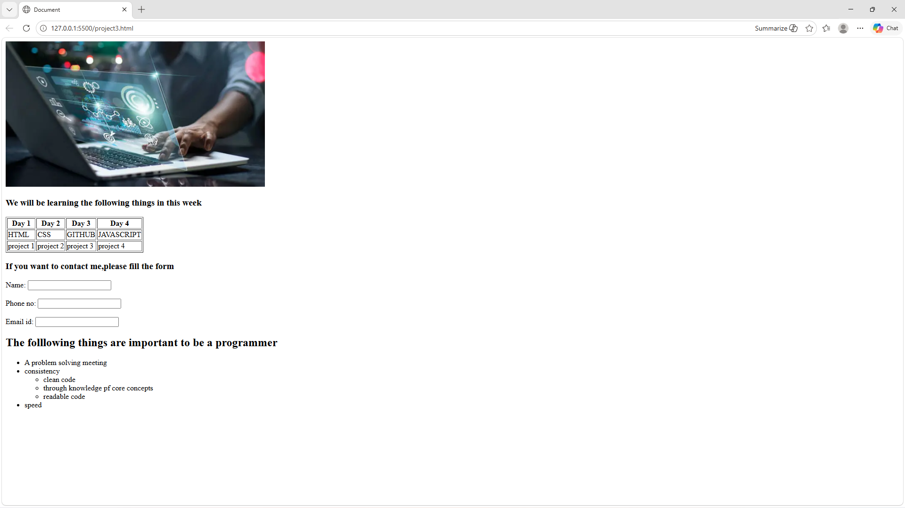

# tailwind css project


# 📘 Weekly Learning Plan Webpage

## 📌 Overview

This project is a simple HTML webpage that displays:

* A learning schedule for a week
* A contact form
* Important qualities required to become a programmer

It is designed as a beginner-friendly static webpage using only HTML.

---

## 🛠️ Technologies Used

* HTML5
* Font Awesome (for icons, though not used yet)

---

## 📂 Features

### 1. 📷 Image Section

Displays a banner image related to programming.

[live@](https://jishnusmanoj2004-gif.github.io/border/)



### 2. 📅 Weekly Learning Table

A table showing topics and projects planned for 4 days:

* Day 1: HTML + Project 1
* Day 2: CSS + Project 2
* Day 3: GitHub + Project 3
* Day 4: JavaScript + Project 4

### 3. 📞 Contact Form

Basic form to collect:

* Name
* Phone number
* Email ID

### 4. 📋 Programmer Skills List

Highlights important qualities:

* Problem-solving mindset
* Consistency

  * Clean code
  * Strong core concepts
  * Readable code
* Speed

---

## ⚠️ Issues in Current Code (Needs Fixing)

### 🔴 Form Issues

* `<form>` tag is not closed
* `<label>` tags are not properly closed
* `input type="NAME"` is invalid → should be `type="text"`

### 🔴 HTML Structure Issues

* Nested `<ul>` is not properly structured
* Some typos:

  * `folllowing` → `following`
  * `pf` → `of`
  * `through` → `thorough`

---

## ✅ Suggested Improvements

* Add proper `<form>` closing tag
* Use semantic HTML (`<section>`, `<header>`, `<footer>`)
* Add CSS for styling
* Validate inputs in the form
* Use consistent indentation

---

## 🚀 How to Run

1. Copy the HTML code
2. Save it as:

   ```
   index.html
   ```
3. Open it in any browser (Chrome, Edge, Firefox)

